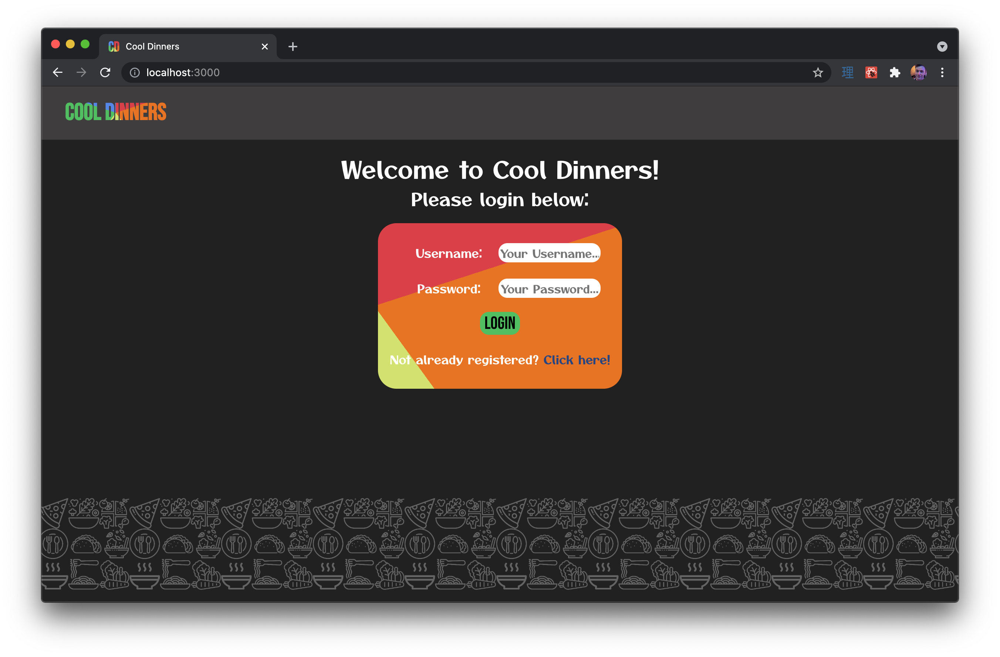
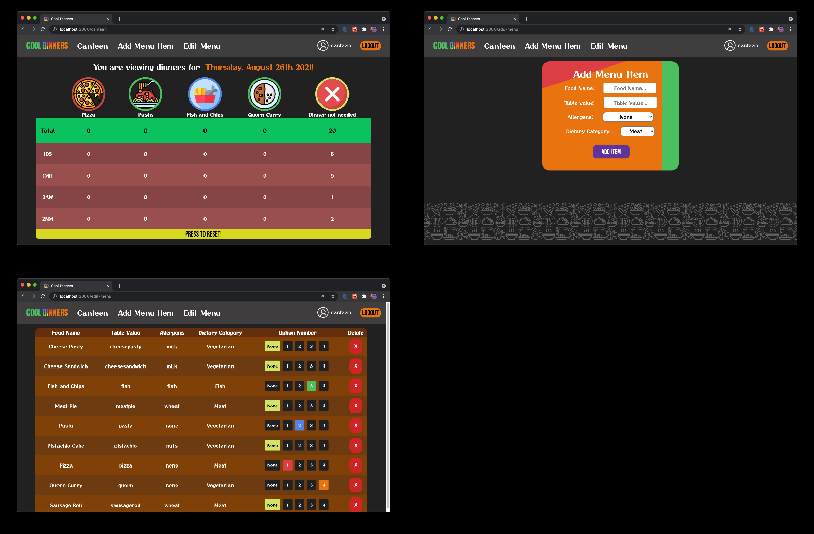
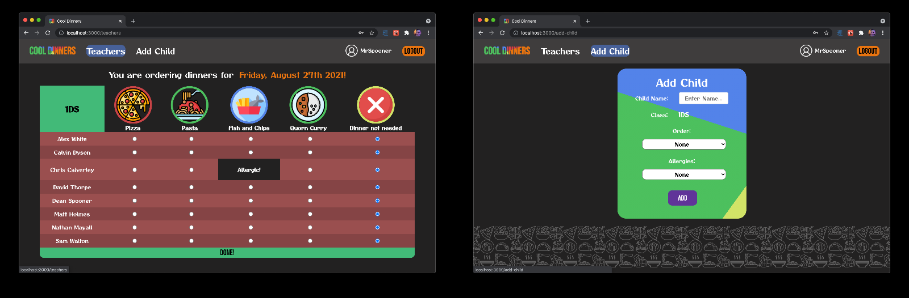
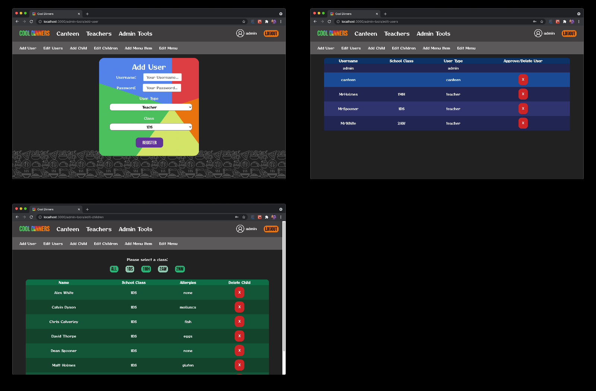

# Welcome to Cool Dinners - the **future** in school dinner ordering!

## By [Matt Holmes](https://github.com/MattHolmes2909) and [Dean Spooner](https://github.com/DeanSpooner)

#### This is a React web app that allows school staff to create and edit food orders for their students. Features include:

- Canteen staff are able to view orders from all school classes and edit the menu;
- Teachers are able to send orders to the canteen, view existing orders for their class, and add children to their registers;
- Children with allergies are unable to order food with matching allergens;
- Admin users are able to add, edit and delete users, children, menu and food options, and can also approve pending users.

---

## Built With:

- Frontend:

  - React;
  - HTML;
  - CSS;
  - JavaScript;
  - Node.js;
  - Axios;
  - Moment.js.
      

- Backend:
  - MySQL;
  - Docker;
  - Express;
  - Heroku.

---

## Previews:

### Login:

### Canteen:

### Teachers:

### Admin:

## 

## Testing Methods:

- Jest;
- React Testing Library.

---

## How to install:

    $ git clone https://github.com/MattHolmes2909/Cool-Dinners-Frontend
    $ cd Cool-Dinners-Frontend
    $ npm install

---

## How to run:

    $ npm start

---

## How to test:

    $ npm test

---

# By [Matt Holmes](https://github.com/MattHolmes2909) and [Dean Spooner](https://github.com/DeanSpooner), 2021

